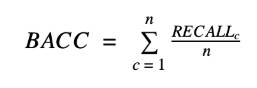
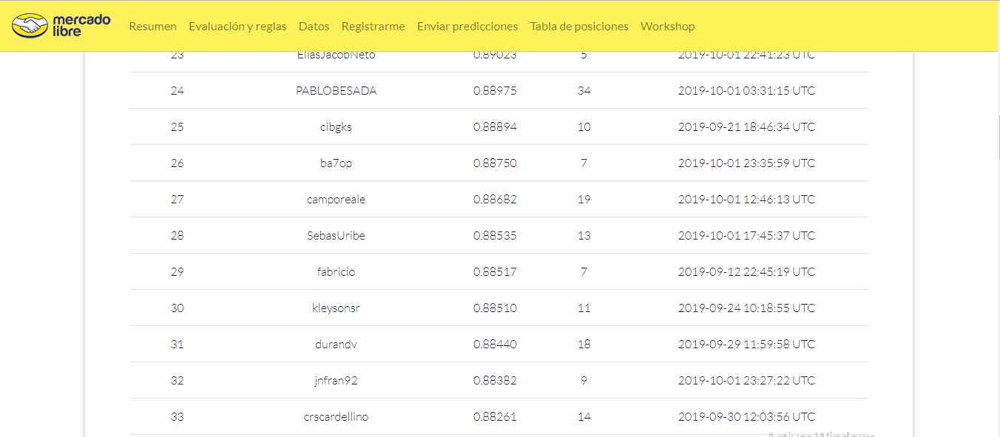

# MERCADOLIBRE DATA CHALLENGE 2019

## El desafío

Entrenar un modelo de aprendizaje automático para categorizar
publicaciones de productos basandose únicamente en los títulos.

[Meli Challenge](https://ml-challenge.mercadolibre.com)

## Evaluación

Métrica
La competencia se evalúa con balanced accuracy como métrica, la cual está definida como:

## Datos de Entrenamiento
Cada fila de los datos de entrenamiento corresponde a una publicación de producto en Mercadolibre e incluye la siguiente información

### Columna	Descripción

*	Title	El título de la publicación
*	Language	El idioma el título, pudiendo ser español o portugués
*	Label quality	Puede ser fiables o no fiables. Para las marcadas como fiables, hemos dedicando tiempo revisado las etiquetas para minimizar la cantidad de errores (sin embargo, podrían no ser 100% fiables). Las filas marcadas como no fiables no fueron revisadas por nosotros, si no que fueron etiquedas por los vendedores y, por lo tanto, se podría esperar una tasa de error mayor.
*	Category	Es la categoría a predecir. El conjunto de posibles categorías es el mismo para ambos idiomas. Es decir, un título de un teléfono celular pertenerá aa la categoría CELLPHONES, independientemente si el título es en español o portugués.

La distribución de casos fiables en el conjunto de entrenamiento no está distribuida uniformemente. Puede haber categorías que contengan muchos ejemplos fiables, así como categorías que no contengan ningún ejemplo fiable en absoluto.

# RESULTADO. 

Balanced Accuracy 0.8853

